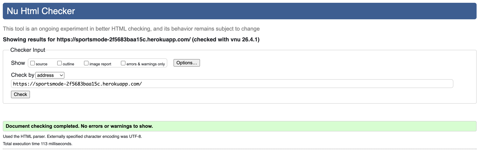
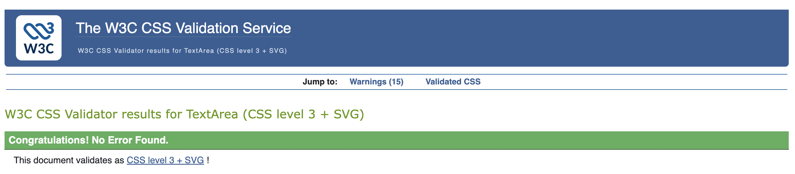
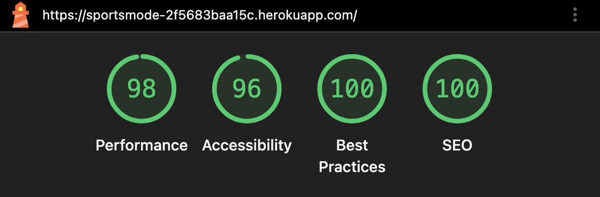
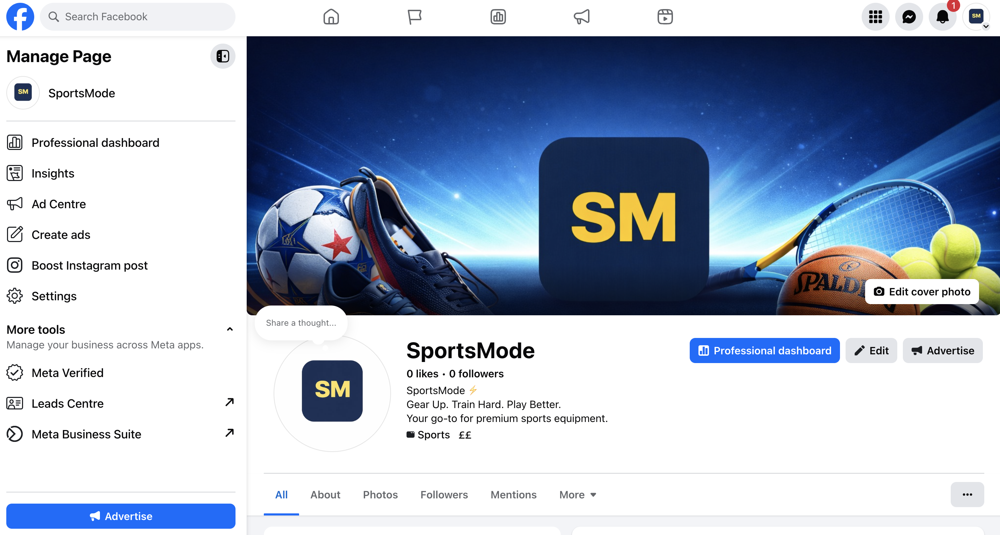

# SportsMode — Premium Sports Equipment E-Commerce Store


**SportsMode** is a full-stack e-commerce web application built with Django. It sells premium sports equipment across four categories — Football, Basketball, Tennis, and Fitness — and is submitted as a Code Institute Portfolio Project 5 (Full Stack E-Commerce).

> **Live Site:** [https://sportsmode-2f5683baa15c.herokuapp.com/](https://sportsmode-2f5683baa15c.herokuapp.com/)  
> **GitHub Repository:** [https://github.com/Esteban-Jr/SportMode](https://github.com/Esteban-Jr/SportMode)

---

## Table of Contents

1. [Project Overview](#project-overview)
2. [User Experience (UX)](#user-experience-ux)
   - [Strategy](#strategy)
   - [User Stories](#user-stories)
   - [Wireframes](#wireframes)
3. [Features](#features)
   - [Existing Features](#existing-features)
   - [Future Features](#future-features)
4. [Technologies Used](#technologies-used)
5. [Testing](#testing)
   - [Automated Tests](#automated-tests)
   - [Manual Testing](#manual-testing)
   - [Browser Compatibility](#browser-compatibility)
   - [Responsiveness](#responsiveness)
   - [Validators](#validators)
   - [Known Bugs](#known-bugs)
6. [Deployment](#deployment)
   - [Local Development](#local-development)
   - [Heroku Deployment](#heroku-deployment)
7. [Credits](#credits)

---

## Project Overview

SportsMode is a B2C e-commerce platform where customers can browse and purchase sports equipment. The project demonstrates a complete e-commerce flow including:

- Product browsing, filtering, and search
- Session-based shopping bag
- Secure Stripe-powered checkout with webhook fallback
- User registration and authentication via django-allauth
- Order history and delivery address management via a user profile
- Newsletter subscription with soft-delete reactivation
- Transactional emails (welcome on registration, order confirmation on purchase)
- Staff product management through the site and via the Django admin panel

The project follows agile development principles and is deployed to Heroku with a PostgreSQL database and Cloudinary for media storage.

---

## User Experience (UX)

### Strategy

**Target Audience:**
- Sports enthusiasts of all levels — amateur to competitive
- People looking to purchase equipment for football, basketball, tennis, or general fitness
- UK-based shoppers who want reliable delivery and easy returns

**Business Goals:**
- Provide a clean, intuitive shopping experience that drives conversions
- Allow staff to manage the product catalogue easily without developer access
- Build a mailing list through newsletter sign-ups
- Retain customers through saved delivery details and order history

**User Goals:**
- Find and purchase sports equipment quickly and with confidence
- Check previous orders and download/print invoices
- Save delivery details for faster future purchases
- Receive confirmation and follow-up communications

---

### User Stories

User stories were tracked during development. They are grouped by Epic below.

#### Epic 1 — Navigation & Browsing

| ID | As a... | I can... | So that... | Priority |
|----|---------|----------|-----------|----------|
| 1 | Shopper | Browse all products | I can see what is available | Must Have |
| 2 | Shopper | Filter products by sport category | I can find relevant equipment quickly | Must Have |
| 3 | Shopper | Search for products by keyword | I can find a specific item I have in mind | Must Have |
| 4 | Shopper | Sort products by price or name | I can compare products easily | Should Have |
| 5 | Shopper | View a product detail page | I can see full information before buying | Must Have |

#### Epic 2 — Shopping Bag & Checkout

| ID | As a... | I can... | So that... | Priority |
|----|---------|----------|-----------|----------|
| 7 | Shopper | Add products to my bag | I can collect items before purchasing | Must Have |
| 8 | Shopper | Update quantities in my bag | I can adjust my order before paying | Must Have |
| 9 | Shopper | Remove items from my bag | I can change my mind without starting over | Must Have |
| 10 | Shopper | See the running bag total in the navbar | I always know how much I am spending | Must Have |
| 11 | Shopper | See how far I am from free delivery | I can decide whether to add more items | Should Have |
| 12 | Shopper | Pay securely with a debit or credit card | I can complete my purchase safely | Must Have |
| 13 | Shopper | Receive an order confirmation email | I have a record and proof of my purchase | Must Have |

#### Epic 3 — User Accounts

| ID | As a... | I can... | So that... | Priority |
|----|---------|----------|-----------|----------|
| 15 | User | Register for an account | I can access my profile and order history | Must Have |
| 16 | User | Log in and log out | I can access my account securely | Must Have |
| 17 | User | Reset my password via email | I can regain access if I forget my password | Must Have |
| 18 | User | Receive a welcome email when I register | I feel welcomed and know registration worked | Should Have |
| 19 | User | Save my default delivery details | I do not have to retype them every order | Should Have |
| 20 | User | View my past orders | I can track what I have purchased | Should Have |
| 21 | User | View a detailed invoice for each past order | I have a clear record I can print | Could Have |

#### Epic 4 — Product Management (Staff)

| ID | As a... | I can... | So that... | Priority |
|----|---------|----------|-----------|----------|
| 22 | Staff member | Add new products | The store catalogue stays up to date | Must Have |
| 23 | Staff member | Edit existing products | I can correct errors or update prices | Must Have |
| 24 | Staff member | Delete products | I can remove discontinued items | Must Have |
| 25 | Staff member | Manage everything via the Django admin | I have full control and oversight | Must Have |

#### Epic 5 — Marketing & Newsletter

| ID | As a... | I can... | So that... | Priority |
|----|---------|----------|-----------|----------|
| 26 | Visitor | Sign up for the newsletter | I receive exclusive deals and updates | Should Have |
| 27 | Returning subscriber | Re-subscribe after unsubscribing | I can opt back in easily | Could Have |

---

### Wireframes

---

#### Homepage — Desktop

```
┌─────────────────────────────────────────────────────────────────┐
│  NAVBAR: [Logo] [Shop ▾] [About] [Contact]   [🔍] [👤] [🛍️ 0]  │
├─────────────────────────────────────────────────────────────────┤
│                                                                  │
│   ┌──────────────────────────┐   ┌──────────────────────────┐  │
│   │  ⚡ New Season, New Gear  │   │                          │  │
│   │                           │   │      [Hero Image]        │  │
│   │  Gear Up.                 │   │                          │  │
│   │  Train Hard.              │   │                          │  │
│   │  Play Better.             │   │                          │  │
│   │                           │   │                          │  │
│   │  [Shop Now] [Our Story]   │   │                          │  │
│   └──────────────────────────┘   └──────────────────────────┘  │
│                                                                  │
├─────────────────────────────────────────────────────────────────┤
│  🚚 Free Delivery  |  ↩ 30-Day Returns  |  🔒 Secure  |  🎧 Support│
├─────────────────────────────────────────────────────────────────┤
│                       Shop by Sport                              │
│  ┌──────────┐  ┌──────────┐  ┌──────────┐  ┌──────────┐       │
│  │    ⚽    │  │    🏀    │  │    🎾    │  │    🏋️   │       │
│  │ Football │  │Basketball│  │  Tennis  │  │  Fitness │       │
│  └──────────┘  └──────────┘  └──────────┘  └──────────┘       │
│                    [View All Products →]                         │
├─────────────────────────────────────────────────────────────────┤
│  Built for Athletes, By Athletes  │ 500+ │ 4.8⭐ │ 10k+ │  4   │
│  ✔ Curated Selection              │      │       │      │      │
│  ✔ Fast, Reliable Delivery        └──────┴───────┴──────┘      │
│  ✔ Easy Returns                                                  │
│  [Learn More About Us]                                           │
├─────────────────────────────────────────────────────────────────┤
│              Stay Ahead of the Game                              │
│         [Email ____________________] [Subscribe]                 │
├─────────────────────────────────────────────────────────────────┤
│  FOOTER: Shop | Account | Help | Social Links | © SportsMode    │
└─────────────────────────────────────────────────────────────────┘
```

---

#### Homepage — Mobile

```
┌─────────────────────────┐
│ [☰ Logo]     [🛍️ 0]    │
├─────────────────────────┤
│  ⚡ New Season           │
│                          │
│  Gear Up.                │
│  Train Hard.             │
│  Play Better.            │
│                          │
│  [Shop Now →]            │
│  [Our Story]             │
│                          │
│     [Hero Image]         │
├─────────────────────────┤
│  🚚 Free | ↩ Returns    │
│  🔒 Secure | 🎧 Support  │
├─────────────────────────┤
│      Shop by Sport       │
│  ┌────────┐ ┌────────┐  │
│  │   ⚽   │ │   🏀   │  │
│  │Football│ │Basket. │  │
│  └────────┘ └────────┘  │
│  ┌────────┐ ┌────────┐  │
│  │   🎾   │ │  🏋️  │  │
│  │ Tennis │ │Fitness │  │
│  └────────┘ └────────┘  │
│  [View All Products →]   │
└─────────────────────────┘
```

---

#### Product Listing Page — Desktop

```
┌─────────────────────────────────────────────────────────────────┐
│  NAVBAR                                                          │
├─────────────────────────────────────────────────────────────────┤
│  Home > Products                                                 │
│  All Products                  Sort by: [Price Low–High ▾]      │
├──────────────┬──────────────────────────────────────────────────┤
│  FILTERS     │                                                   │
│              │  ┌───────────┐  ┌───────────┐  ┌───────────┐   │
│  Categories  │  │[Prod.Img] │  │[Prod.Img] │  │[Prod.Img] │   │
│  ○ All       │  │  Name     │  │  Name     │  │  Name     │   │
│  ○ Football  │  │  Sport    │  │  Sport    │  │  Sport    │   │
│  ○ Basketball│  │  £XX.XX   │  │  £XX.XX   │  │  £XX.XX   │   │
│  ○ Tennis    │  │[Add to Bag│  │[Add to Bag│  │[Add to Bag│   │
│  ○ Fitness   │  └───────────┘  └───────────┘  └───────────┘   │
│              │                                                   │
│  Sport       │  ┌───────────┐  ┌───────────┐  ┌───────────┐   │
│  ○ All       │  │[Prod.Img] │  │[Prod.Img] │  │[Prod.Img] │   │
│  ○ Football  │  │   ...     │  │   ...     │  │   ...     │   │
│  ○ Basketball│  └───────────┘  └───────────┘  └───────────┘   │
│  ○ Tennis    │                                                   │
│  ○ Fitness   │                                                   │
└──────────────┴──────────────────────────────────────────────────┘
```

---

#### Product Detail Page

```
┌─────────────────────────────────────────────────────────────────┐
│  NAVBAR                                                          │
├─────────────────────────────────────────────────────────────────┤
│  Home > Products > Product Name                                  │
│                                                                  │
│  ┌──────────────────────────┐  ┌───────────────────────────┐   │
│  │                          │  │  Product Name              │   │
│  │    [Product Image]       │  │  Category | Sport Badge    │   │
│  │                          │  │  SKU: XXXXXX               │   │
│  │                          │  │                            │   │
│  │                          │  │  £XX.XX  ~~£XX.XX~~  -X%  │   │
│  └──────────────────────────┘  │                            │   │
│                                 │  ✔ In Stock (XX units)    │   │
│                                 │                            │   │
│                                 │  Qty:  [−] [1] [+]        │   │
│                                 │  [Add to Bag]              │   │
│                                 │                            │   │
│                                 │  Description               │   │
│                                 │  Lorem ipsum dolor sit...  │   │
│                                 └───────────────────────────┘   │
│                                                                  │
│  ── You May Also Like ──────────────────────────────────────    │
│  ┌────────┐  ┌────────┐  ┌────────┐  ┌────────┐               │
│  │ Prod 1 │  │ Prod 2 │  │ Prod 3 │  │ Prod 4 │               │
│  └────────┘  └────────┘  └────────┘  └────────┘               │
└─────────────────────────────────────────────────────────────────┘
```

---

#### Shopping Bag

```
┌─────────────────────────────────────────────────────────────────┐
│  NAVBAR                                                          │
├─────────────────────────────────────────────────────────────────┤
│  Your Bag  (3 items in your bag)                                 │
│                                                                  │
│  ⚠ Spend £XX.XX more to get free delivery!                      │
│                                                                  │
│  ┌───────────────────────────────────┐  ┌─────────────────────┐│
│  │[Img] Product Name       £XX.XX    │  │   Order Summary     ││
│  │      Sport / SKU  [−][2][+] [↺][🗑]│  │                     ││
│  │               Subtotal: £XX.XX   │  │ Subtotal   £XX.XX   ││
│  ├───────────────────────────────────┤  │ Delivery   £XX.XX   ││
│  │[Img] Product Name       £XX.XX    │  │ ─────────────────   ││
│  │      Sport / SKU  [−][1][+] [↺][🗑]│  │ Total      £XX.XX   ││
│  ├───────────────────────────────────┤  │                     ││
│  │[Img] Product Name       £XX.XX    │  │ [Proceed to Chk →]  ││
│  │      Sport / SKU  [−][3][+] [↺][🗑]│  │ 🔒 Secure via Stripe││
│  └───────────────────────────────────┘  └─────────────────────┘│
│  [← Continue Shopping]                                           │
└─────────────────────────────────────────────────────────────────┘
```

---

#### Checkout Page

```
┌─────────────────────────────────────────────────────────────────┐
│  NAVBAR                                                          │
├─────────────────────────────────────────────────────────────────┤
│  Checkout                                                        │
│  ┌────────────────────────────────────┐  ┌───────────────────┐ │
│  │  Delivery Details                  │  │  Order Summary    │ │
│  │                                    │  │                   │ │
│  │  Full Name:  [________________]    │  │  [Img] Prod  ×2   │ │
│  │  Email:      [________________]    │  │        £XX.XX     │ │
│  │  Phone:      [________________]    │  │  [Img] Prod  ×1   │ │
│  │  Address 1:  [________________]    │  │        £XX.XX     │ │
│  │  Address 2:  [________________]    │  │  ──────────────   │ │
│  │  Town/City:  [________________]    │  │  Subtotal £XX.XX  │ │
│  │  County:     [________________]    │  │  Delivery £XX.XX  │ │
│  │  Postcode:   [________________]    │  │  Total    £XX.XX  │ │
│  │  Country:    [Select Country ▾]    │  └───────────────────┘ │
│  │                                    │                        │
│  │  ☐ Save delivery info to profile   │                        │
│  │                                    │                        │
│  │  Payment                           │                        │
│  │  [  Stripe Card Element          ] │                        │
│  │                                    │                        │
│  │  [Complete Order — £XX.XX]         │                        │
│  └────────────────────────────────────┘                        │
└─────────────────────────────────────────────────────────────────┘
```

---

#### User Profile Page

```
┌─────────────────────────────────────────────────────────────────┐
│  NAVBAR                                                          │
├─────────────────────────────────────────────────────────────────┤
│  My Profile                                                      │
│  ┌─────────────────────────────┐  ┌────────────────────────────┐│
│  │  Default Delivery Details   │  │  Order History             ││
│  │                             │  │                            ││
│  │  Full Name: [___________]   │  │  Order #  Date  Total View ││
│  │  Phone:     [___________]   │  │  ABC123  01/04  £45.00 [→] ││
│  │  Address 1: [___________]   │  │  DEF456  15/03  £32.00 [→] ││
│  │  Address 2: [___________]   │  │  GHI789  02/03  £78.00 [→] ││
│  │  Town/City: [___________]   │  │                            ││
│  │  County:    [___________]   │  │                            ││
│  │  Postcode:  [___________]   │  │                            ││
│  │  Country:   [Select ▾]      │  │                            ││
│  │                             │  │                            ││
│  │  [Update Information]       │  │                            ││
│  └─────────────────────────────┘  └────────────────────────────┘│
└─────────────────────────────────────────────────────────────────┘
```

---

#### Order Detail (Invoice) Page

```
┌─────────────────────────────────────────────────────────────────┐
│  [SportsMode Logo]                        [🖨 Print Invoice]     │
│  ━━━━━━━━━━━━━━━━━━━━━━━━━━━━━━━━━━━━━━━━━━━━━━━━━━━━━━━━━━━  │
│  ORDER  #ABC123XYZ789...                                         │
│  ━━━━━━━━━━━━━━━━━━━━━━━━━━━━━━━━━━━━━━━━━━━━━━━━━━━━━━━━━━━  │
│                                                                  │
│  Date: 01 April 2025          Email: customer@example.com        │
│                                                                  │
│  ┌──────────────────────────┐  ┌──────────────────────────────┐ │
│  │  Delivery Address        │  │  Payment Summary             │ │
│  │  John Smith              │  │  Subtotal:    £XX.XX         │ │
│  │  1 Test Street           │  │  Delivery:    £X.XX          │ │
│  │  London, EC1 1AA         │  │  ───────────────────         │ │
│  │  United Kingdom          │  │  Grand Total: £XX.XX         │ │
│  └──────────────────────────┘  └──────────────────────────────┘ │
│                                                                  │
│  ── Items Ordered ───────────────────────────────────────────   │
│  [Img]  Product Name           Qty    Unit Price   Subtotal      │
│         Category               2      £XX.XX       £XX.XX       │
│  [Img]  Product Name           Qty    Unit Price   Subtotal      │
│         Category               1      £XX.XX       £XX.XX       │
│  ─────────────────────────────────────────────────────────────  │
│  [← Back to Profile]                                             │
└─────────────────────────────────────────────────────────────────┘
```

---

#### Authentication Pages

```
┌─────────────────────────────┐   ┌─────────────────────────────┐
│  Sign In                    │   │  Register                   │
│                             │   │                             │
│  Username or Email:         │   │  Username:                  │
│  [____________________]     │   │  [____________________]     │
│                             │   │                             │
│  Password:                  │   │  Email:                     │
│  [____________________]     │   │  [____________________]     │
│                             │   │                             │
│  [Sign In]                  │   │  Password:                  │
│                             │   │  [____________________]     │
│  Forgot password? [Reset]   │   │                             │
│  Don't have an account?     │   │  Confirm Password:          │
│  [Register →]               │   │  [____________________]     │
│                             │   │                             │
└─────────────────────────────┘   │  [Register]                 │
                                   └─────────────────────────────┘
```

---

## Features

### Existing Features

#### Navigation
- Responsive navbar with Bootstrap 5 collapse for mobile
- **Shop** dropdown with sport category links: ⚽ Football, 🏀 Basketball, 🎾 Tennis, 🏋️ Fitness
- Live bag item count badge that updates on every add/remove
- Search bar available on all pages — searches product name, description, and short description
- Account dropdown — shows **Login / Register** for guests, **My Profile / Logout** for authenticated users
- Staff members see an additional **Product Management** admin link

#### Homepage
- Hero section with headline, call-to-action buttons, and a Cloudinary-hosted image (responsive across all screen sizes)
- Feature strip highlighting: Free Delivery, 30-Day Returns, Secure Payment, Expert Support
- Sport category cards (⚽🏀🎾🏋️) each linking to a pre-filtered product listing
- "Built for Athletes" section with social proof stats (500+ products, 4.8 rating, 10k+ customers)
- Newsletter sign-up form in the CTA banner

#### Product Listing
- Responsive product grid (1 column mobile, 2 tablet, 3 desktop)
- Sidebar filter by **category** and by **sport**
- Keyword search across name, description, and short description
- Sort by: Price (low–high), Price (high–low), Name (A–Z), Newest
- Sale badge on discounted products showing original price struck through and savings percentage
- Out-of-stock indicator on cards

#### Product Detail
- Full product information: name, category, sport, SKU, description
- Sale pricing display: current price, original price struck through, and % savings
- Stock availability indicator with exact unit count
- Quantity selector (+/− buttons capped at available stock)
- Add to Bag button with flash message confirmation
- Related products section — up to 4 products from the same category

#### Shopping Bag
- Session-based cart — no login required
- Per-item quantity update form with +/− steppers
- Per-item remove button
- Free delivery progress bar ("Spend £X.XX more for free delivery!")
- Order summary with per-line subtotals, delivery cost, and grand total
- Stale product protection — if a product is deleted, it is silently removed from the session on next page load

#### Checkout
- Delivery form pre-filled from saved profile for logged-in users
- "Save delivery information to my profile" checkbox
- Stripe Elements card input — no card data ever touches the server
- Stripe PaymentIntent created server-side with bag metadata attached for webhook fallback
- Guest checkout fully supported — no account needed
- Form validation with inline error messages

#### Checkout Success
- Full order summary displayed on confirmation page
- Order confirmation email sent to the customer (HTML + plain text)
- Session bag cleared after successful payment

#### Stripe Webhook Handler
- `payment_intent.succeeded` — creates the order from metadata if the form POST failed
- Idempotency via `stripe_pid` — prevents duplicate orders from form + webhook both firing
- Retries order lookup 5 times with 1-second sleep to account for async processing timing
- `payment_intent.payment_failed` — logged without action

#### User Authentication (django-allauth)
- Register with username, email, and password
- Login with either username or email
- Password reset via email link
- Post-login redirect: **staff/superusers → `/admin/`**, **regular users → `/profile/`**
- Welcome email sent exactly once on registration (via `user_signed_up` signal)

#### User Profile
- View and update default delivery address (pre-populates at checkout)
- Full order history table with date, order number, and grand total
- Link to detailed invoice page for every past order

#### Order Detail (Invoice)
- Invoice-style layout with order metadata, delivery address snapshot, and payment summary
- Line items table with product thumbnail, name, quantity, unit price, and subtotal
- Print button with print-optimised CSS (`@media print`)

#### Newsletter Subscription
- Email sign-up form on homepage CTA and in the site footer
- Three distinct outcomes with tailored messages:
  - **New subscriber** — created, success message
  - **Already active** — info message, no duplicate created
  - **Previously unsubscribed** — reactivated, success message
- Invalid email rejected with error message
- POST-redirect-GET pattern prevents re-submission on browser refresh
- Returns user to the page they submitted from (HTTP_REFERER)

#### Staff Product Management (Front-end)
- **Add Product** — full form with Cloudinary image upload
- **Edit Product** — pre-filled form for any existing product
- **Delete Product** — confirmation page before deletion
- All views restricted to `is_staff` or `is_superuser` via a custom `@staff_required` decorator

#### Django Admin
- **Products:** list/filter/search with inline price and stock editing, fieldset layout, auto-slug generation
- **Orders:** `OrderLineItem` inline, all financial/audit fields read-only, searchable by order number, name, and email
- **Newsletter Subscribers:** bulk reactivate/deactivate actions, quick `is_active` toggle, read-only email and date

#### Flash Messages
- Success, error, info, and warning messages displayed as dismissible Bootstrap alerts
- Full HTML rendering supported (bold product names in bag confirmation messages)

---

### Future Features

- **Product Reviews & Ratings** — allow customers to leave star ratings and written reviews on products
- **Wishlist** — save products without adding to the bag, persisted to the database for logged-in users
- **Discount Codes / Vouchers** — apply coupon codes at checkout for a percentage or fixed discount
- **Stock Notifications** — email a customer when an out-of-stock product becomes available again
- **Social Login** — register and log in with Google or Facebook via allauth social providers
- **Order Tracking** — display a shipping status and tracking number on the order detail page
- **Email Unsubscribe Page** — a dedicated landing page for newsletter unsubscription via a tokenised link

---

## Technologies Used

### Languages

- **Python 3.12.9** — back-end application logic
- **HTML5** — templating via Django's template engine
- **CSS3** — custom styling (`static/css/base.css`)
- **JavaScript** — Stripe Elements integration and bag quantity stepper UI

### Frameworks & Libraries

| Package | Version | Purpose |
|---------|---------|---------|
| Django | 4.2.29 | Core web framework |
| django-allauth | 65.14.3 | User authentication: register, login, password reset |
| django-countries | 8.2.0 | Country select field on checkout and profile forms |
| django-cloudinary-storage | 0.3.0 | Cloudinary as Django's media file backend |
| cloudinary | 1.44.1 | Cloudinary Python SDK |
| stripe | 15.0.1 | Stripe PaymentIntents and webhook handling |
| Pillow | 11.3.0 | Image field support for product photos |
| whitenoise | 6.9.0 | Efficient static file serving in production |
| gunicorn | 23.0.0 | Production WSGI server |
| psycopg2-binary | 2.9.10 | PostgreSQL database driver |
| dj-database-url | 2.3.0 | Parse DATABASE_URL environment variable for Heroku |
| python-decouple | 3.8 | Environment variable management via `.env` file |
| Bootstrap | 5.3.3 | CSS framework (CDN) |
| Bootstrap Icons | 1.11.3 | Icon library (CDN) |

### Databases

| Environment | Database |
|-------------|----------|
| Development | SQLite (`db.sqlite3`) |
| Production | PostgreSQL (Heroku Postgres add-on) |

### Cloud Services

| Service | Purpose |
|---------|---------|
| Heroku | Application hosting and deployment |
| Cloudinary | Product image and media file storage |
| Stripe | Payment processing, PaymentIntents, and webhooks |

### Development Tools

- **Git** — version control
- **GitHub** — remote code repository
- **VS Code** — IDE
- **python-decouple / `.env`** — local environment variable management

---

## Testing

- **HTML** — All HTML templates were tested using the [W3C Markup Validation Service](https://validator.w3.org/). 



- **CSS** — All custom CSS was tested with the [W3C CSS Validator](https://jigsaw.w3.org/css-validator/). 



- **Lighthouse** used to evaluate performance, accessibility, SEO, and best practices.



### Automated Tests

All **61 automated tests** pass. Run the full test suite with:

```bash
python manage.py test
```

Run a single app's tests:

```bash
python manage.py test home
python manage.py test products
python manage.py test bag
python manage.py test checkout
python manage.py test profiles
python manage.py test newsletter
```

#### Test Summary by App

| App | Tests | Coverage Areas |
|-----|-------|---------------|
| home | 9 | Page loads return 200, correct templates used, contact form valid POST sends email, invalid POST does not crash, redirect behaviour |
| products | 6 | Category slug auto-generation on save, `is_on_sale` property, `discount_percentage` property, `is_in_stock` property, product list and detail views return 200 |
| bag | 8 | Add product stores in session, adding same product increments quantity, update bag changes quantity, update with 0 removes item, remove view deletes item, free delivery applied above threshold, delivery charged below threshold, `product_count` context variable |
| checkout | 10 | Order number auto-generated on first save, idempotency (order number unchanged on re-save), `lineitem_total` calculated on save, `update_total()` sets `order_total`, `grand_total` equals order + delivery, free delivery applied above threshold, delivery charged below threshold, post_save signal triggers recalculation, post_delete signal triggers recalculation |
| profiles | 9 | UserProfile auto-created on User creation, `__str__` returns "{username} profile", one profile per user, profile page returns 200 when logged in, redirect to login when logged out, correct template used, form POST saves phone number, context contains `form`, context contains `orders`, order detail returns 404 for non-existent order number |
| newsletter | 9 | `__str__` returns email, `is_active` defaults True, unique email enforced at DB, new email creates subscriber, duplicate active email not duplicated, inactive email reactivated on POST, invalid email does not create subscriber, redirects to referer, GET request returns 405 |
| **Total** | **61** | |

---

### Manual Testing

#### Navigation

| Test | Expected Result | Pass/Fail |
|------|----------------|-----------|
| Click logo | Redirects to homepage | ✅ Pass |
| Shop → Football | Products filtered to Football | ✅ Pass |
| Shop → Basketball | Products filtered to Basketball | ✅ Pass |
| Shop → Tennis | Products filtered to Tennis | ✅ Pass |
| Shop → Fitness | Products filtered to Fitness | ✅ Pass |
| Search — valid keyword | Returns matching products | ✅ Pass |
| Search — no results | Shows "no products found" state | ✅ Pass |
| Bag icon — empty | Shows empty bag state | ✅ Pass |
| Bag icon — items present | Badge shows correct count | ✅ Pass |
| Footer links | All navigate to correct pages | ✅ Pass |

#### Products

| Test | Expected Result | Pass/Fail |
|------|----------------|-----------|
| Browse all products | All active products displayed | ✅ Pass |
| Filter by category | Only matching products shown | ✅ Pass |
| Filter by sport | Only matching products shown | ✅ Pass |
| Sort: price low–high | Ascending by price | ✅ Pass |
| Sort: price high–low | Descending by price | ✅ Pass |
| Sort: name A–Z | Alphabetical order | ✅ Pass |
| View product detail | Full info and image displayed | ✅ Pass |
| Related products | Up to 4 from same category | ✅ Pass |
| Out of stock product | Out of stock indicator shown | ✅ Pass |
| Sale product | Original price struck through, saving shown | ✅ Pass |

#### Shopping Bag

| Test | Expected Result | Pass/Fail |
|------|----------------|-----------|
| Add product to bag | Item in bag, count badge updates | ✅ Pass |
| Add same product twice | Quantity increments | ✅ Pass |
| Update quantity | New quantity saved, subtotal recalculates | ✅ Pass |
| Remove item | Item gone, totals update | ✅ Pass |
| Order total below £50 | £3.99 delivery applied | ✅ Pass |
| Order total at/above £50 | Free delivery applied | ✅ Pass |
| Free delivery delta shown | "Spend £X.XX more" message displays | ✅ Pass |

#### Checkout & Payment

| Test | Expected Result | Pass/Fail |
|------|----------------|-----------|
| Checkout with empty bag | Redirect with error message | ✅ Pass |
| Valid card payment | Order created, success page shown | ✅ Pass |
| Invalid card number | Stripe error message shown inline | ✅ Pass |
| Order confirmation email | Email received with correct order details | ✅ Pass |
| Order in profile history | Order appears in order history list | ✅ Pass |
| Save delivery info checked | Profile updated with entered address | ✅ Pass |
| Guest checkout | Order created without user profile | ✅ Pass |

#### User Authentication

| Test | Expected Result | Pass/Fail |
|------|----------------|-----------|
| Register new account | Account created, welcome email sent, redirect to profile | ✅ Pass |
| Login with username | Successful, redirect to profile | ✅ Pass |
| Login with email | Successful, redirect to profile | ✅ Pass |
| Staff login | Redirect to /admin/ | ✅ Pass |
| Logout | Session cleared, redirect to homepage | ✅ Pass |
| Password reset | Reset email received, new password accepted | ✅ Pass |
| Access profile when logged out | Redirect to login page | ✅ Pass |
| Access order detail — other user | 403 Forbidden | ✅ Pass |

#### Newsletter

| Test | Expected Result | Pass/Fail |
|------|----------------|-----------|
| Subscribe — new email | Subscriber created, success message | ✅ Pass |
| Subscribe — already active | Info message, no duplicate | ✅ Pass |
| Subscribe — previously unsubscribed | Reactivated, success message | ✅ Pass |
| Subscribe — invalid email | Error message, no record created | ✅ Pass |
| Submit from a product page | Redirect back to that product page | ✅ Pass |

#### Staff Product Management

| Test | Expected Result | Pass/Fail |
|------|----------------|-----------|
| Add product (staff) | Product created and visible in store | ✅ Pass |
| Edit product (staff) | Product updated correctly | ✅ Pass |
| Delete product (staff) | Product removed, confirmed page shown | ✅ Pass |
| Access add product (non-staff) | 403 Forbidden | ✅ Pass |

---

### Browser Compatibility

| Browser | Version | Result |
|---------|---------|--------|
| Google Chrome | 124 | ✅ Pass |
| Mozilla Firefox | 125 | ✅ Pass |
| Apple Safari | 17 | ✅ Pass |
| Microsoft Edge | 124 | ✅ Pass |

---

### Responsiveness

| Breakpoint | Device Width | Result |
|------------|-------------|--------|
| Mobile (sm) | 375px | ✅ Pass |
| Tablet (md) | 768px | ✅ Pass |
| Desktop (lg) | 1024px | ✅ Pass |
| Wide (xl) | 1440px | ✅ Pass |

---

### Validators

| Type | Tool | Result |
|------|------|--------|
| HTML | W3C Markup Validator | No errors |
| CSS | W3C CSS Validator | No errors |
| Python | PEP8 / flake8 | No errors |
| Accessibility | WAVE Web Accessibility Tool | No critical errors |

---

### Known Bugs

No known bugs remain. Previously resolved issues:

| Bug | Root Cause | Fix |
|-----|-----------|-----|
| Order totals always showing as £0.00 | `update_total()` existed on the Order model but was never called after line items were created | Created `checkout/signals.py` with `post_save` and `post_delete` receivers on `OrderLineItem` that call `order.update_total()` automatically |
| Newsletter reactivation failing | `SubscriberForm` is a `ModelForm` with `unique=True` on email — `form.is_valid()` returned False for duplicate emails before the reactivation logic could run | Added `validate_unique()` override in `SubscriberForm` that does nothing (`pass`), allowing the view to handle duplicates with tailored messages |
| Flash messages displaying raw HTML tags | `{{ message }}` in `base.html` auto-escaped `<strong>` to `&lt;strong&gt;` | Changed to `{{ message|safe }}` |
| Bag showing stale count after a completed checkout | Browser back/forward cache served a stale shop page with the old bag count | Inherent browser caching behaviour — the bag context processor was also hardened to silently remove any deleted product IDs from the session instead of raising a 404 |

---

## Deployment

### Prerequisites

The following accounts and services are required before deploying:

- [Heroku](https://heroku.com) account
- [Cloudinary](https://cloudinary.com) account
- [Stripe](https://stripe.com) account
- [GitHub](https://github.com) account

---

### Local Development

#### 1. Clone the Repository

```bash
git clone https://github.com/YOUR_USERNAME/sportsmode.git
cd sportsmode
```

#### 2. Create and Activate a Virtual Environment

```bash
python -m venv venv
source venv/bin/activate       # Mac/Linux
venv\Scripts\activate          # Windows
```

#### 3. Install Dependencies

```bash
pip install -r requirements.txt
```

#### 4. Create a `.env` File

Create a `.env` file in the project root:

```
SECRET_KEY=your-django-secret-key
DEBUG=True
ALLOWED_HOSTS=localhost,127.0.0.1

CLOUDINARY_CLOUD_NAME=your-cloud-name
CLOUDINARY_API_KEY=your-api-key
CLOUDINARY_API_SECRET=your-api-secret

STRIPE_PUBLIC_KEY=pk_test_...
STRIPE_SECRET_KEY=sk_test_...
STRIPE_WH_SECRET=whsec_...

DEFAULT_FROM_EMAIL=SportsMode <noreply@sportsmode.co.uk>
SITE_DOMAIN=localhost:8000
```

#### 5. Apply Migrations and Create a Superuser

```bash
python manage.py migrate
python manage.py createsuperuser
```

#### 6. Run the Development Server

```bash
python manage.py runserver
```

Visit `http://localhost:8000` in your browser.

---

### Heroku Deployment

#### 1. Create the Heroku App

```bash
heroku create sportsmode
```

#### 2. Add Heroku Postgres

```bash
heroku addons:create heroku-postgresql:essential-0
```

#### 3. Set Config Vars

In **Heroku Dashboard → Settings → Config Vars**, add:

| Key | Value |
|-----|-------|
| `SECRET_KEY` | Your production secret key |
| `DEBUG` | `False` |
| `ALLOWED_HOSTS` | `your-app.herokuapp.com` |
| `DATABASE_URL` | Auto-set by Heroku Postgres add-on |
| `CLOUDINARY_CLOUD_NAME` | Your Cloudinary cloud name |
| `CLOUDINARY_API_KEY` | Your Cloudinary API key |
| `CLOUDINARY_API_SECRET` | Your Cloudinary API secret |
| `STRIPE_PUBLIC_KEY` | `pk_live_...` |
| `STRIPE_SECRET_KEY` | `sk_live_...` |
| `STRIPE_WH_SECRET` | `whsec_...` (from step 9 below) |
| `DEFAULT_FROM_EMAIL` | `SportsMode <noreply@sportsmode.co.uk>` |
| `SITE_DOMAIN` | `your-app.herokuapp.com` |
| `EMAIL_HOST` | e.g. `smtp.gmail.com` |
| `EMAIL_PORT` | `587` |
| `EMAIL_USE_TLS` | `True` |
| `EMAIL_HOST_USER` | Your email address |
| `EMAIL_HOST_PASSWORD` | Your email app password |

#### 4. Collect Static Files

```bash
python manage.py collectstatic
```

#### 5. Push to Heroku

```bash
git push heroku main
```

#### 6. Run Migrations on Heroku

```bash
heroku run python manage.py migrate
```

#### 7. Create a Superuser on Heroku

```bash
heroku run python manage.py createsuperuser
```

#### 8. Set the Heroku Stack (if needed)

```bash
heroku stack:set heroku-22
```

#### 9. Configure the Stripe Webhook

1. In the Stripe Dashboard go to **Developers → Webhooks**
2. Click **Add endpoint**
3. Set URL to: `https://your-app.herokuapp.com/checkout/wh/`
4. Select events: `payment_intent.succeeded` and `payment_intent.payment_failed`
5. Copy the **Signing secret** and set it as `STRIPE_WH_SECRET` in Heroku config vars

---

### Key Project Files

| File | Purpose |
|------|---------|
| `Procfile` | Tells Heroku to run: `web: gunicorn sportsmode.wsgi:application` |
| `runtime.txt` | Pins Python version to `python-3.12.9` |
| `requirements.txt` | All Python package dependencies |
| `.env` | Local environment variables — **never committed to git** |
| `.gitignore` | Excludes `.env`, `staticfiles/`, `db.sqlite3`, `media/`, `__pycache__/` |

---

## Facebook



## Credits

### Code & Inspiration

- **Boutique Ado** (Code Institute walkthrough project) — The checkout flow, Stripe PaymentIntent integration pattern, webhook handler structure, session-based bag context processor, and core Order model design were all inspired by and adapted from the Boutique Ado walkthrough project. Significant customisation was applied throughout.
- **Django Documentation** — signals, context processors, custom decorators, class-based views reference
- **django-allauth Documentation** — custom adapter for post-login redirect and `user_signed_up` signal integration
- **Stripe Documentation** — PaymentIntents API, webhook event handling, and Stripe Elements integration

### Media

- Hero image and logo: original assets created for SportsMode, hosted on Cloudinary
- Product images: sourced for demonstration purposes only; all rights belong to their respective owners

### Acknowledgements

- My Code Institute mentor for guidance throughout the project
- Code Institute student support and tutor assistance
- The Code Institute Slack community for peer support
